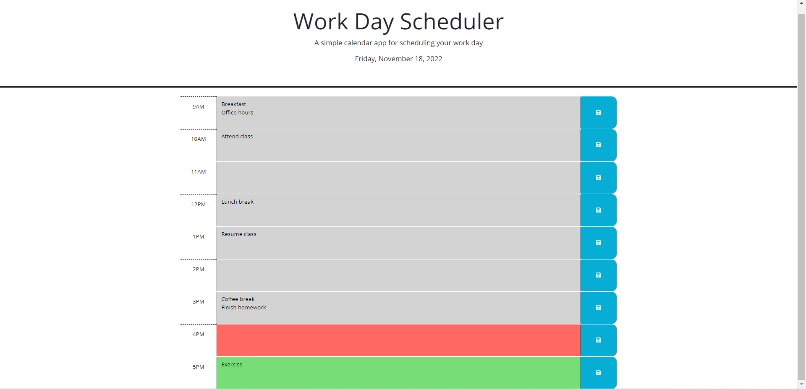

# Work Day Scheduler

## Description

This work day scheduler is a daily planner that can be used to create a schedule of events for standard business hours (9AM to 5PM). This was built so that employees with busy schedules can manage their time effectively on a day-to-day basis by keeping track of important events and monitoring the current time of day. This project was also done to help me learn how to use jQuery to dynamically update HTML and CSS as well as how to work with the Day.js library to retrieve the current date and time.

## Usage

Click on Website URL: https://avanimuchhala.github.io/work-day-scheduler/

Once on the website, you will see the current date in the top header. The 9AM-5PM schedule is broken into hour chunks, which are color coded to indicate which hour block is in the past (gray), present (red), or future (green). Click on an hour block and type in events for that hour. Then click on the blue save button to the right of that hour block to save the events for that time so that when you reopen the browser or refresh the page, your events persist in the schedule.

Below is a screenshot of the work day scheduler: 

## License

MIT License. Please refer to the LICENSE in the repo.

## How to Contribute

If you would like to contribute to this project, please email me at: avani.muchhala@case.edu.